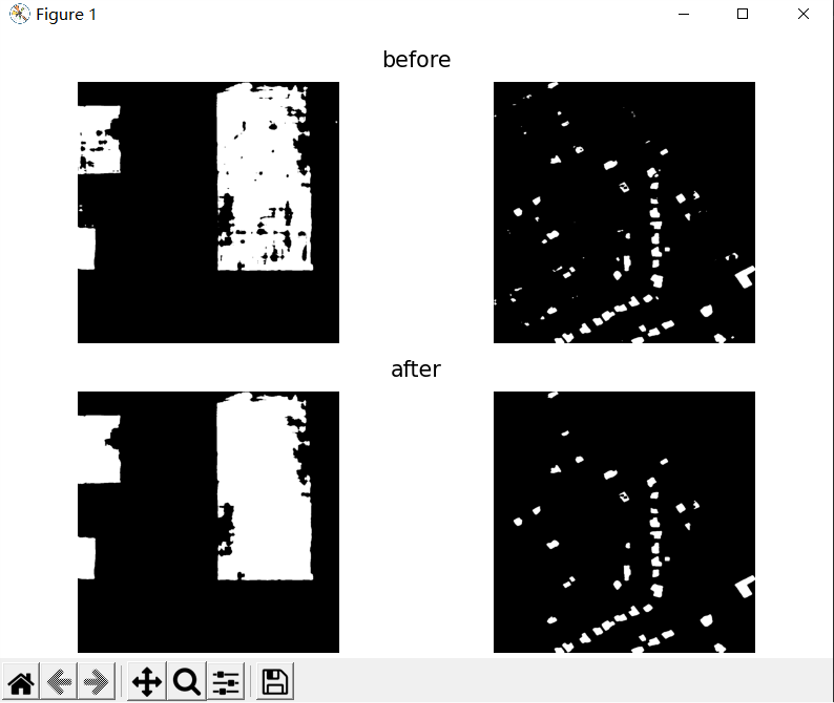

# 变化检测功能使用说明
## 功能说明：用户上传同一地区不同时期的一组图像后系统进行预测，返回给用户这一地区的变化部分结果图。
## 使用方法：变化检测需要上传第一时期和第二时期的图，分别在两个上传框内上传，可以一次上传多张图，为了将属于同一组的两张图片匹配在一起，需要它们有相同的命名，上传不符合规范如两上传框的上传图片数不同，属于一组的图片没有相同的命名，上传的文件格式错误都会有相应信息提示。
1.可选择的图像预处理操作：
 - 直方图匹配（适用于两幅图像风格差异比较大时，效果为使两幅图片风格保持一致）
 - 图像锐化（适用于图像分辨率较低，建筑物边缘模糊时，效果为增强建筑物的边缘、轮廓）
 
2.可选择的降噪处理：
 - 平滑
 - 滤波
  
3.可选择的后处理：
 - 结果图渲染（用户可以选择自己的风格对预测结果图进行渲染）效果如下图所示：
  

    
  

  
 - 连通域滤波+填充孔洞（去除伪变化噪声点以及填充建筑物内的孔洞，使结果更加接近真实情况）效果如下图所示：
  

    
  

